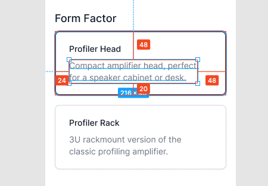
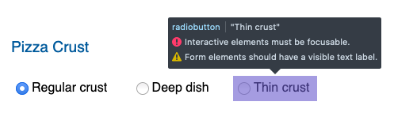

## Configuration Options

- The form factor options have different sizing than the other options:

  

  Note the `48px` padding on the right side. This is only present on the `xs` screen for these options.

- The configuration options have a subtle difference in the default state: they used `border-gray-300` where the images use `border-gray-200`.

- The `role="radiobutton"` items throw an error in accessibility checkers: "Form elements should have a visible label". I scoured the ARIA docs for the best practice here, and turns out the [official best practice example](https://w3c.github.io/aria-practices/examples/radio/radio-2/radio-2.html) fails too, so that's fun.

  

## Specifications

- Not much to note here, other than how awesome `grid` works for definition lists!

## Footer

- Starting price from the header doesn't match the base price in the footer when base config is selected.
